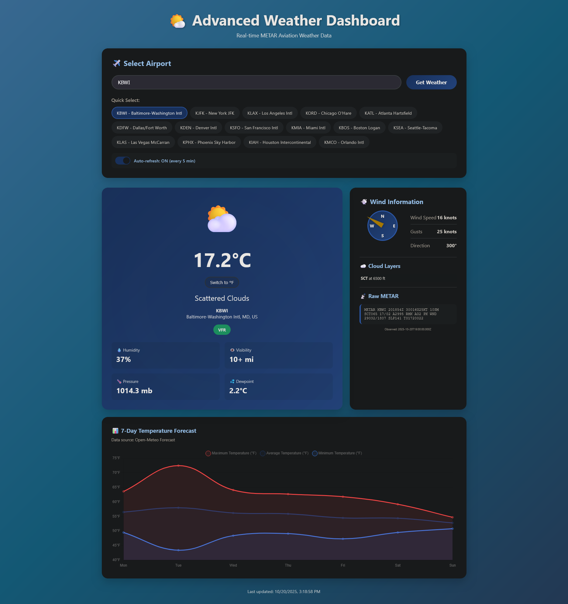

# 🌤️ Advanced Weather Dashboard

A beautiful, feature-rich Flask web application that displays **real-time aviation weather data** and **7-day temperature forecasts** for airports worldwide.

  

## ✨ Features

### 🌍 Real-Time Weather Data
- **Live METAR data** from Aviation Weather API
- Current temperature (with °C/°F toggle)
- Wind speed, gusts, and direction
- Animated wind compass with smart VRB detection
- Humidity, visibility, and barometric pressure
- Cloud layers and flight category (VFR/MVFR/IFR/LIFR)
- **Dynamic weather icons** based on conditions
- **Dynamic backgrounds** that change with weather (clear, cloudy, rainy, thunderstorm)

### 📊 7-Day Temperature Forecast
- **Real forecast data** from Open-Meteo API
- Interactive Chart.js visualization
- Shows min, max, and average temperatures
- Location-based forecasts using airport coordinates

### ✈️ Airport Selection
- Search any airport by ICAO code (KJFK, EGLL, YSSY, etc.)
- 15 popular airports for quick selection
- Beautiful chip-based UI with active highlighting
- Auto-uppercase input validation

### 🎨 Modern UI/UX
- Stunning gradient backgrounds that change with weather conditions
- **Animated thunderstorm backgrounds** with lightning effects
- Smooth animations (floating icons, pulsing effects)
- Glassmorphism design elements
- Hover effects and transitions
- Fully responsive mobile design
- Weather emoji favicon

### 🔄 Advanced Features
- **Auto-refresh toggle** - Updates every 5 minutes
- **Temperature unit toggle** - Switch between °C and °F
- **Live clock** - Shows last update time
- **Persistent settings** - Remembers preferences using localStorage
- **Error handling** - Graceful fallbacks if APIs fail

## 🚀 Quick Start

### Prerequisites
- Python 3.8 or higher
- pip (Python package manager)

### Installation

1. **Clone or download project**
   ```bash
   cd weather_app
   ```

2. **Install dependencies**
   ```bash
   pip install -r requirements.txt
   ```

3. **Run application**
   ```bash
   python app.py
   ```

4. **Open your browser**
   Navigate to: `http://127.0.0.1:5000`

## 📁 Project Structure

```
weather_app/
├── app.py                 # Flask backend with API integrations
├── requirements.txt       # Python dependencies
├── README.md             # This file
└── templates/
    └── index.html        # Frontend HTML/CSS/JavaScript
```

## 🔧 Configuration

### Changing Default Airport
Edit the default airport in `app.py`:
```python
station_code = request.args.get('station', 'KBWI').upper()  # Change 'KBWI'
```

### Adding More Popular Airports
Add to the `POPULAR_AIRPORTS` list in `app.py`:
```python
POPULAR_AIRPORTS = [
    {'code': 'YOUR_ICAO', 'name': 'Your Airport Name'},
    # ... more airports
]
```

## 🌐 API Sources

This application uses **free, public APIs** - no API keys required!

1. **Aviation Weather API**
   - Source: https://aviationweather.gov
   - Data: Real-time METAR weather observations
   - Coverage: Airports worldwide

2. **Open-Meteo API**
   - Source: https://open-meteo.com
   - Data: 7-day temperature forecasts
   - Coverage: Global weather forecasts

## 🎯 Usage Examples

### Search Any Airport
- Type "KJFK" for New York JFK
- Type "EGLL" for London Heathrow
- Type "YSSY" for Sydney
- Type "RJTT" for Tokyo Narita

### URL Parameters
You can also use URL parameters:
```
http://127.0.0.1:5000/?station=KLAX
```

### Weather Backgrounds
The dashboard automatically changes backgrounds based on weather conditions:
- ☀️ **Clear Sky** - Light blue gradient
- 🌤️ **Few Clouds** - Soft blue gradient
- ⛅ **Scattered Clouds** - Steel blue gradient
- 🌥️ **Broken Clouds** - Gray-blue gradient
- ☁️ **Overcast** - Dark gray gradient
- 🌧️ **Rain** - Dark stormy gradient
- ⛈️ **Thunderstorm** - Dark purple with animated lightning

## 🛠️ Technologies Used

- **Backend:** Flask (Python web framework)
- **Frontend:** HTML5, CSS3, JavaScript
- **Charts:** Chart.js
- **APIs:** Aviation Weather API, Open-Meteo API
- **Design:** CSS animations, gradients, glassmorphism

## 📊 Features Breakdown

| Feature | Status | Description |
|---------|--------|-------------|
| Live Weather | ✅ | Real-time METAR data |
| Temperature Toggle | ✅ | Switch °C/°F |
| Wind Compass | ✅ | Animated direction indicator |
| 7-Day Forecast | ✅ | Real forecast data |
| Dynamic Backgrounds | ✅ | Weather-based gradients + animations |
| Airport Search | ✅ | Any ICAO code |
| Auto-Refresh | ✅ | 5-minute intervals |
| Mobile Responsive | ✅ | Works on all devices |
| Error Handling | ✅ | Graceful fallbacks |

## 🎨 Customization

### Changing Colors
Edit the CSS in `templates/index.html`:
```css
body {
    background: linear-gradient(135deg, #667eea 0%, #764ba2 100%);
}
```

### Modifying Auto-Refresh Interval
Change the interval in JavaScript:
```javascript
setInterval(() => {
    location.reload();
}, 5 * 60 * 1000); // Change from 5 minutes to your preference
```

## 🐛 Troubleshooting

**Port already in use:**
```bash
# Kill process using port 5000
# Windows: taskkill //F //IM python.exe
# Linux/Mac: pkill -9 python
```

**API not responding:**
- Check your internet connection
- The app will fallback to sample data if APIs are unavailable

**Dependencies not installing:**
```bash
# Try upgrading pip first
python -m pip install --upgrade pip
pip install -r requirements.txt
```

## 📝 License

This project is open source and available under the MIT License.

## 🌟 Contributing

Feel free to fork, modify, and share! Contributions are welcome.

## 📸 Screenshots

![Weather Dashboard]!

---

**Enjoy your weather dashboard!** 🌤️✈️📊